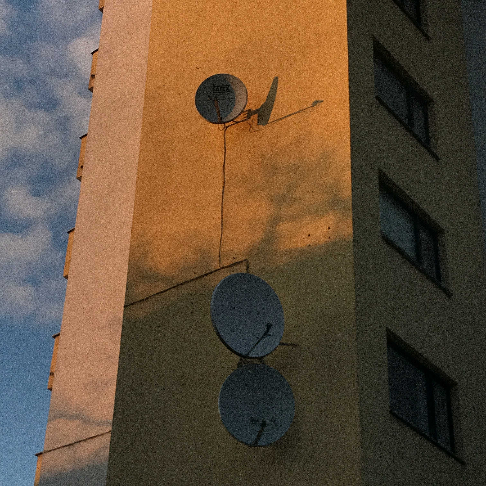
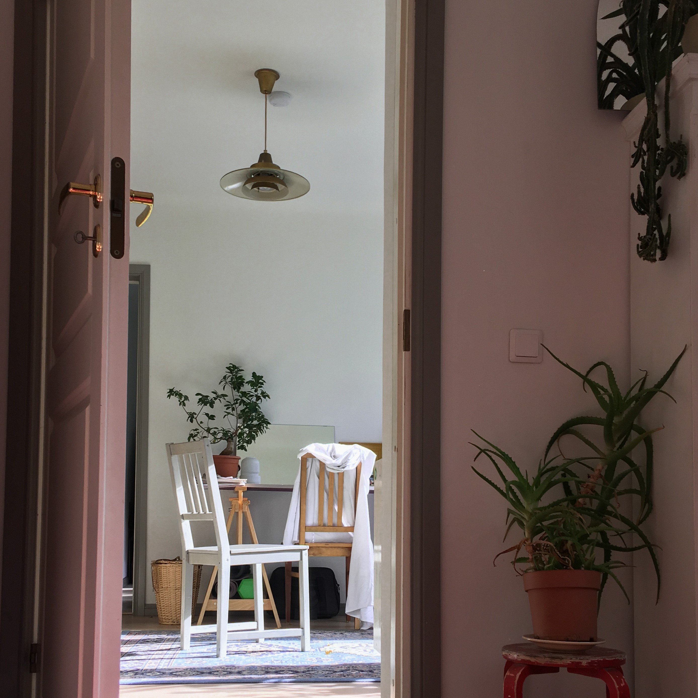
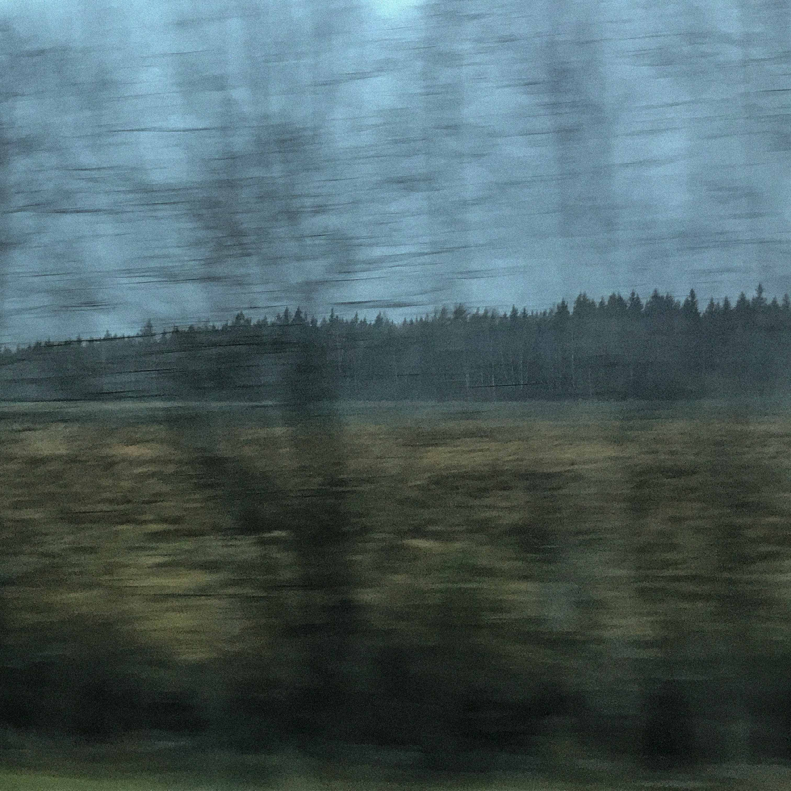
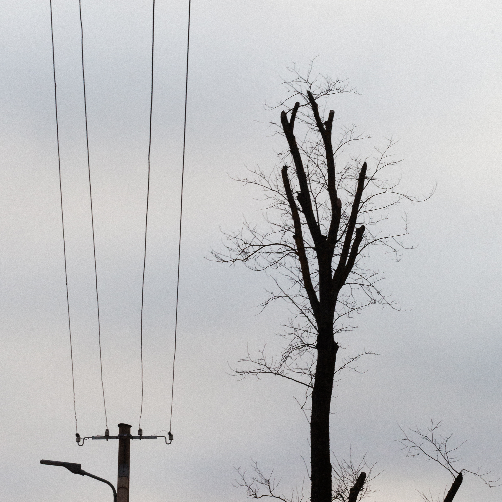
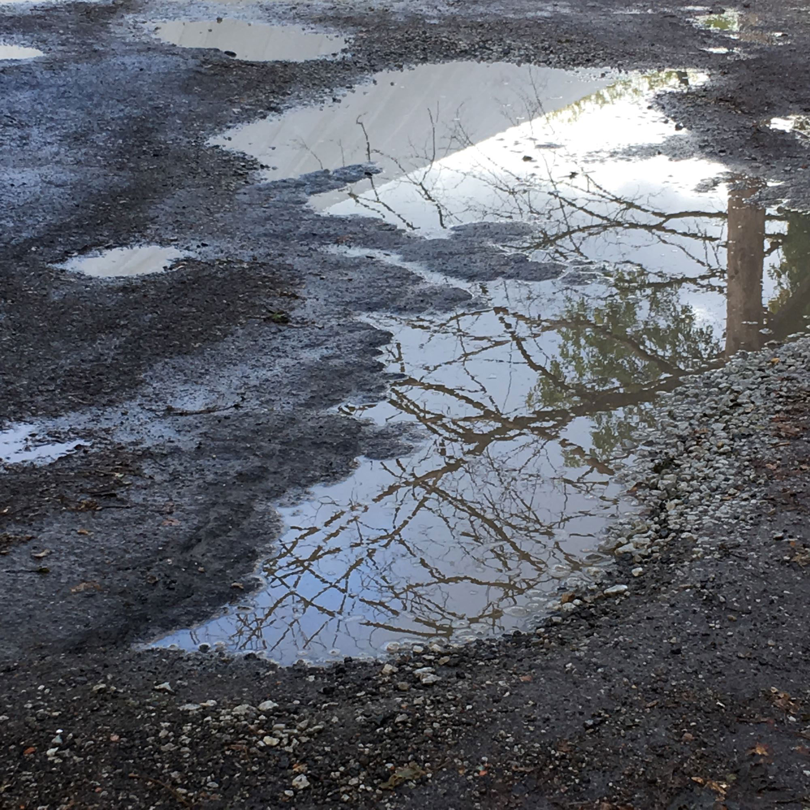
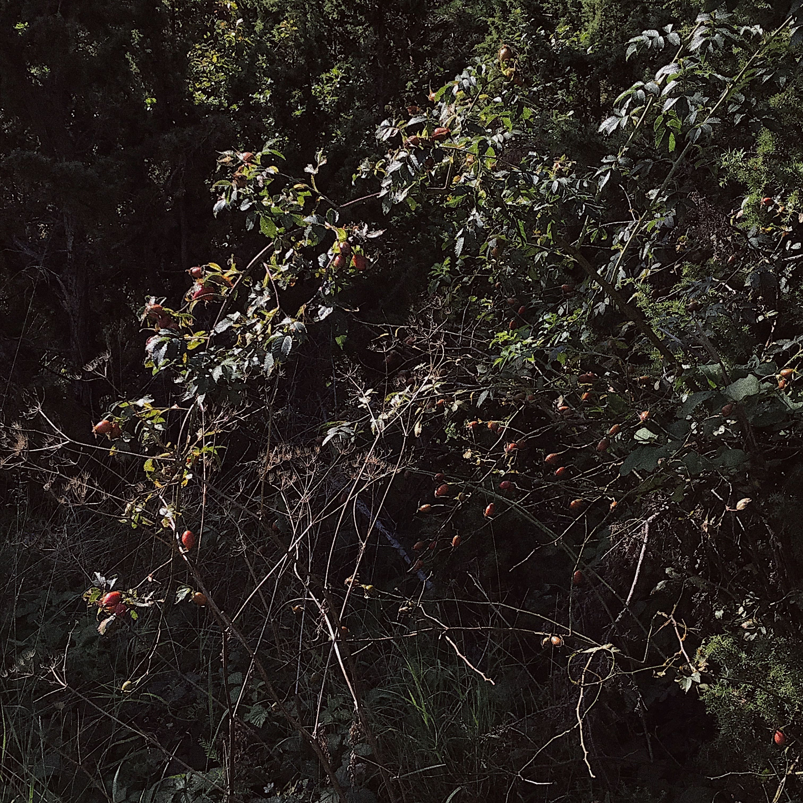
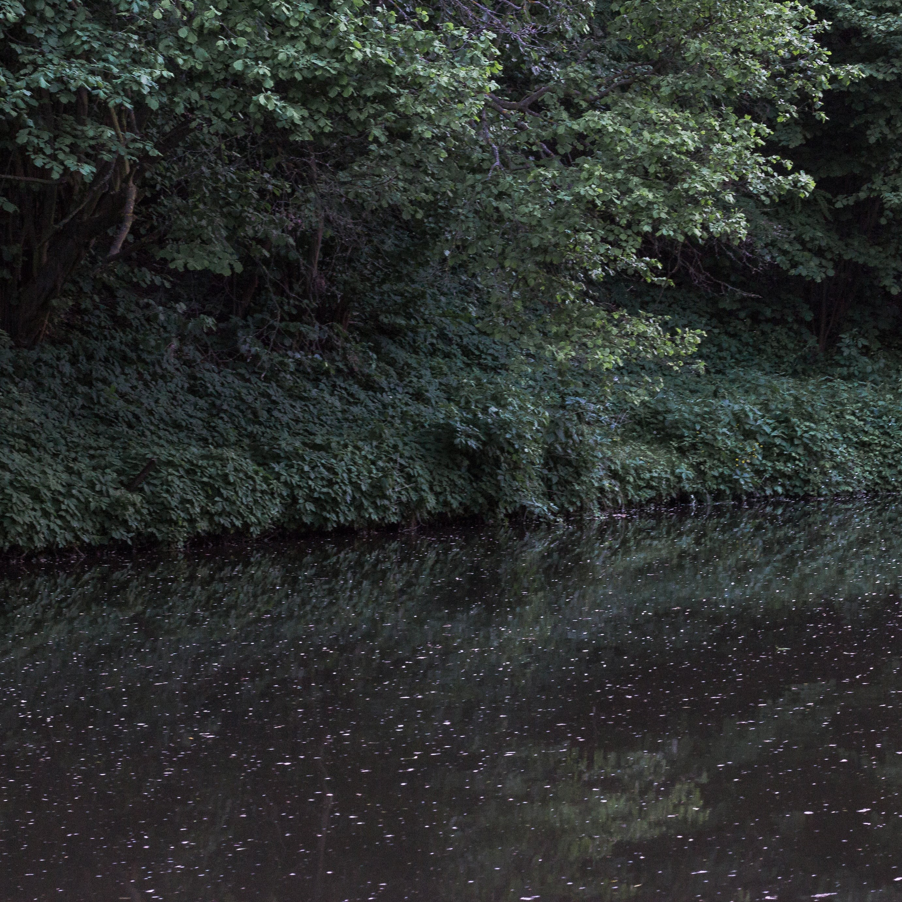
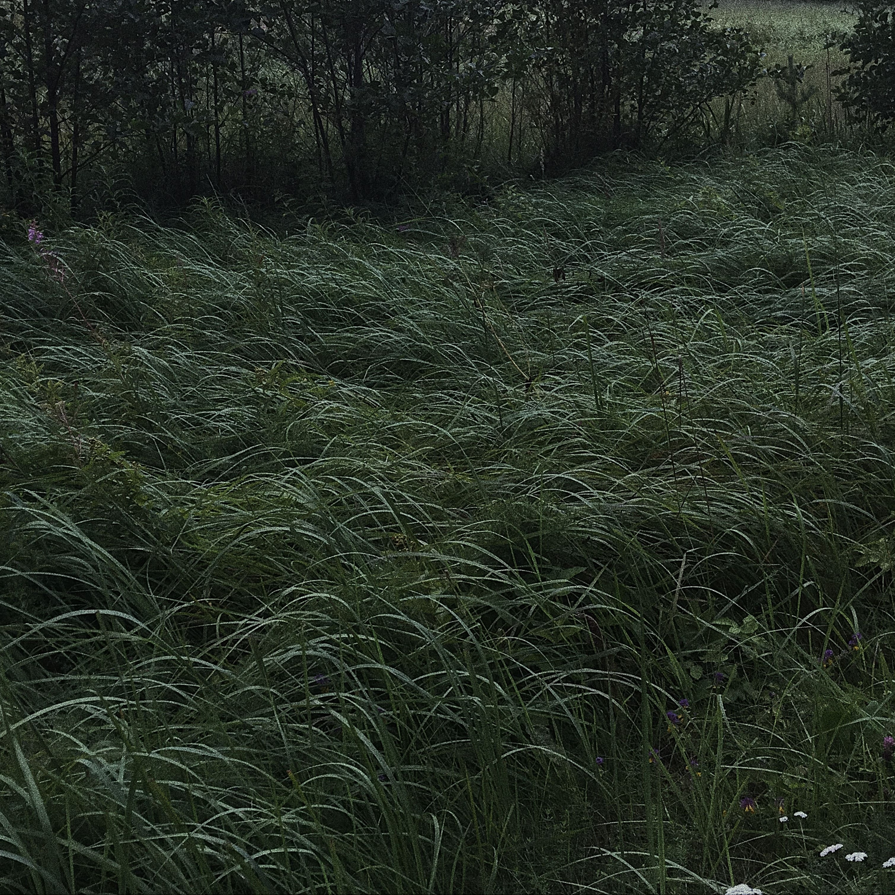
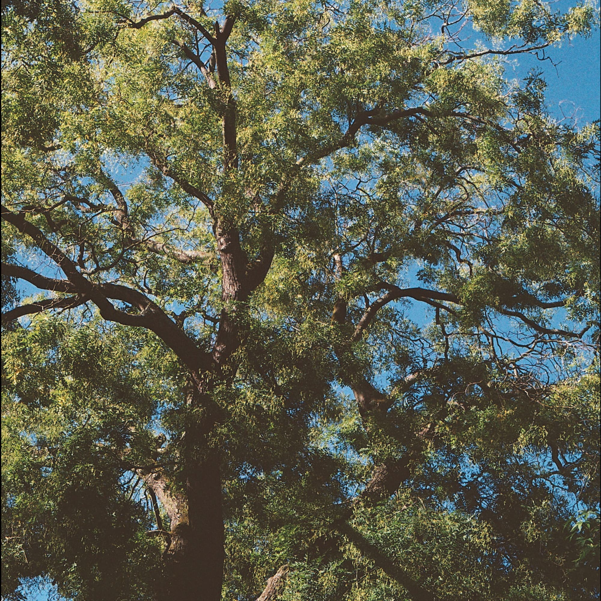

<!DOCTYPE html>
<html lang="en">
  <head>
    <meta charset="UTF-8" />
    <meta name="viewport" content="width=device-width, initial-scale=1.0" />
    <meta http-equiv="X-UA-Compatible" content="ie=edge" />
    <meta
      name="description"
      content="Luulesaade mõniminut ilmub iga kuu viimasel päeval."
    />
    <link rel="stylesheet" href="style.css?v=2.2" />
    <link
      href="https://fonts.googleapis.com/css?family=Quicksand:300,400,500,600,700&display=swap"
      rel="stylesheet"
    />
    <link
      rel="stylesheet"
      type="text/css"
      href="player/dist/css/green-audio-player.css"
    />
    <title>MÕNIMINUT</title>
  </head>
  <body>
    <!--   navigation   -->
    

      <header class="selectDisable" id="desktop-header">mõni minut</header>
      <header id="mobile-header">
        <a href="#" class="selectDisable">MENÜÜ</a>
      </header>
      <ul id="menu-list">
        <li class="menu-year selectDisable">2020</li>
        <li>
          <a class="nav-link selectDisable active" id="12">12 Juuli</a>
        </li>
        <li>
          <a class="nav-link selectDisable" id="11">11 Juuni</a>
        </li>
        <li>
          <a class="nav-link selectDisable" id="10">10 Mai</a>
        </li>
        <li>
          <a class="nav-link selectDisable" id="09">09 Aprill</a>
        </li>
        <li>
          <a class="nav-link selectDisable" id="08">08 Märts</a>
        </li>
        <li>
          <a class="nav-link selectDisable" id="07">07 Veebruar</a>
        </li>
        <li>
          <a class="nav-link selectDisable" id="06">06 Jaanuar</a>
        </li>
        <li class="menu-year">2019</li>
        <li>
          <a class="nav-link selectDisable" id="05">05 Detsember</a>
        </li>
        <li>
          <a class="nav-link selectDisable" id="04">04 November</a>
        </li>
        <li>
          <a class="nav-link selectDisable" id="03">03 Oktoober</a>
        </li>
        <li>
          <a class="nav-link selectDisable" id="02">02 September</a>
        </li>
        <li>
          <a class="nav-link selectDisable" id="01">01 August</a>
        </li>
        <li class="menu-year selectDisable">mõniminut</li>
        <li>
          <a class="nav-link selectDisable" id="tutvustus">Tutvustus</a>
        </li>
        <li><a class="nav-link selectDisable" id="meist">Meist</a></li>
        <li><a class="nav-link selectDisable">&nbsp;</a></li>
      </ul>
    

    

      <!--   12: JUULI 2020    -->
      <section class="section-container display" id="12">
        

          
        

        <header class="episode-header">Juuli</header>
        

          MÕNIMINUT - 30.06.2020 -
          <a
            href="ep/MONIMINUT_12_JUULI_2020.mp3"
            download="MONIMINUT_12_JUULI_2020.mp3"
            >LAADI ALLA</a
          >
          -
          <a
            href="voldik/MONIMINUT_12_JUULI_2020.pdf"
            target="
          _blank"
            >VOLDIK</a
          >
        

        

          <audio crossorigin>
            <source src="ep/MONIMINUT_12_JUULI_2020.mp3" type="audio/mp3" />
            Your browser does not support the audio element.
          </audio>
        

      </section>

      <!--   11: JUUNI 2020    -->
      <section class="section-container hidden" id="11">
        

          
        

        <header class="episode-header">Juuni</header>
        

          MÕNIMINUT - 30.06.2020 -
          <a
            href="ep/MONIMINUT_11_JUUNI_2020.mp3"
            download="MONIMINUT_11_JUUNI_2020.mp3"
            >LAADI ALLA</a
          >
          -
          <a
            href="voldik/MONIMINUT_11_JUUNI_2020.pdf"
            target="
          _blank"
            >VOLDIK</a
          >
        

        

          <audio crossorigin>
            <source src="ep/MONIMINUT_11_JUUNI_2020.mp3" type="audio/mp3" />
            Your browser does not support the audio element.
          </audio>
        

      </section>

      <!--   10: MAI 2020    -->
      <section class="section-container hidden" id="10">
        

          
        

        <header class="episode-header">Mai</header>
        

          MÕNIMINUT - 31.05.2020 -
          <a
            href="ep/MONIMINUT_10_MAI_2020.mp3"
            download="MONIMINUT_10_MAI_2020.mp3"
            >LAADI ALLA</a
          >
          -
          <a
            href="voldik/MONIMINUT_10_MAI_2020.pdf"
            target="
          _blank"
            >VOLDIK</a
          >
        

        

          <audio crossorigin>
            <source src="ep/MONIMINUT_10_MAI_2020.mp3" type="audio/mp3" />
            Your browser does not support the audio element.
          </audio>
        

      </section>

      <!--   09: APRILL 2020    -->
      <section class="section-container hidden" id="09">
        

          
        

        <header class="episode-header">Aprill</header>
        

          MÕNIMINUT - 30.04.2020 -
          <a
            href="ep/MONIMINUT_09_APRILL_2020.mp3"
            download="MONIMINUT_09_APRILL_2020.mp3"
            >LAADI ALLA</a
          >
          -
          <a
            href="voldik/MONIMINUT_09_APRILL_2020.pdf"
            target="
          _blank"
            >VOLDIK</a
          >
        

        

          <audio crossorigin>
            <source src="ep/MONIMINUT_09_APRILL_2020.mp3" type="audio/mp3" />
            Your browser does not support the audio element.
          </audio>
        

      </section>

      <!--   08: MÄRTS 2020    -->
      <section class="section-container hidden" id="08">
        

          
        

        <header class="episode-header">Märts</header>
        

          MÕNIMINUT - 31.03.2020 -
          <a
            href="ep/MONIMINUT_08_MARTS_2020.mp3"
            download="MONIMINUT_08_MARTS_2020.mp3"
            >LAADI ALLA</a
          >
          -
          <a
            href="voldik/MONIMINUT_08_MARTS_2020.pdf"
            target="
          _blank"
            >VOLDIK</a
          >
        

        

          <audio crossorigin>
            <source src="ep/MONIMINUT_08_MARTS_2020.mp3" type="audio/mp3" />
            Your browser does not support the audio element.
          </audio>
        

      </section>

      <!--  07: VEEBRUAR 2020  -->
      <section class="section-container hidden" id="07">
        

          
        

        <header class="episode-header">Veebruar</header>
        

          MÕNIMINUT - 29.02.2020 -
          <a
            href="ep/MONIMINUT_07_VEEBRUAR_2020.mp3"
            download="MONIMINUT_07_VEEBRUAR_2020.mp3"
            >LAADI ALLA</a
          >
          -
          <a
            href="voldik/MONIMINUT_07_VEEBRUAR_2020.pdf"
            target="
          _blank"
            >VOLDIK</a
          >
        

        

          <audio crossorigin>
            <source src="ep/MONIMINUT_07_VEEBRUAR_2020.mp3" type="audio/mp3" />
            Your browser does not support the audio element.
          </audio>
        

      </section>

      <!--   06: JAANUAR 2020  -->
      <section class="section-container hidden" id="06">
        

          
        

        <header class="episode-header">Jaanuar</header>
        

          MÕNIMINUT - 31.01.2020 -
          <a href="ep/06_JAANUAR_2020.mp3" download="06_JAANUAR_2020.mp3"
            >LAADI ALLA</a
          >
          -
          <a
            href="voldik/06_JAANUAR_2020.pdf"
            target="
          _blank"
            >VOLDIK</a
          >
        

        

          <audio crossorigin>
            <source src="ep/06_JAANUAR_2020.mp3" type="audio/mp3" />
            Your browser does not support the audio element.
          </audio>
        

      </section>

      <!--  05: DETSEMBER 2019 -->
      <section class="section-container hidden" id="05">
        

          
        

        <header class="episode-header">Detsember</header>
        

          MÕNIMINUT - 31.12.2019 -
          <a href="ep/05_DETSEMBER_2019.mp3" download="05_DETSEMBER_2019.mp3"
            >LAADI ALLA</a
          >
          -
          <a
            href="voldik/05_DETSEMBER_2019.pdf"
            target="
          _blank"
            >VOLDIK</a
          >
        

        

          <audio crossorigin>
            <source src="ep/05_DETSEMBER_2019.mp3" type="audio/mp3" />
            Your browser does not support the audio element.
          </audio>
        

      </section>

      <!--  04: NOVEMBER 2019 -->
      <section class="section-container hidden" id="04">
        

          
        

        <header class="episode-header">November</header>
        

          MÕNIMINUT - 30.11.2019 -
          <a href="ep/04_NOVEMBER_2019.mp3" download="04_NOVEMBER_2019.mp3"
            >LAADI ALLA</a
          >
          -
          <a
            href="voldik/04_NOVEMBER_2019.pdf"
            target="
          _blank"
            >VOLDIK</a
          >
        

        

          <audio crossorigin>
            <source src="ep/04_NOVEMBER_2019.mp3" type="audio/mp3" />
            Your browser does not support the audio element.
          </audio>
        

      </section>

      <!-- 03: OKTOOBER 2019   -->
      <section class="section-container hidden" id="03">
        

          
        

        <header class="episode-header">Oktoober</header>
        

          MÕNIMINUT - 31.10.2019 -
          <a href="ep/03_OKTOOBER_2019.mp3" download="03_OKTOOBER_2019.mp3"
            >LAADI ALLA</a
          >
          -
          <a
            href="voldik/03_OKTOOBER_2019.pdf"
            target="
            _blank"
            >VOLDIK</a
          >
        

        

          <audio crossorigin>
            <source src="ep/03_OKTOOBER_2019.mp3" type="audio/mp3" />
            Your browser does not support the audio element.
          </audio>
        

      </section>

      <!-- 02: SEPTEMBER 2019  -->
      <section class="section-container hidden" id="02">
        

          
        

        <header class="episode-header">September</header>
        

          MÕNIMINUT - 30.09.2019 -
          <a href="ep/02_SEPTEMBER_2019.mp3" download="02_SEPTEMBER_2019.mp3"
            >LAADI ALLA</a
          >
          -
          <a
            href="voldik/02_SEPTEMBER_2019.pdf"
            target="
          _blank"
            >VOLDIK</a
          >
        

        

          <audio crossorigin>
            <source src="ep/02_SEPTEMBER_2019.mp3" type="audio/mp3" />
            Your browser does not support the audio element.
          </audio>
        

      </section>

      <!-- 01: AUGUST 2019-->
      <section class="section-container hidden" id="01">
        

          
        

        <header class="episode-header">August</header>
        

          MÕNIMINUT - 31.08.2019 -
          <a href="ep/01_AUGUST_2019.mp3" download="01_AUGUST_2019.mp3"
            >LAADI ALLA</a
          >
          -
          <a
            href="voldik/01_AUGUST_2019.pdf"
            target="
          _blank"
            >VOLDIK</a
          >
        

        

          <audio crossorigin>
            <source src="ep/01_AUGUST_2019.mp3" type="audio/mp3" />
            Your browser does not support the audio element.
          </audio>
        

      </section>

      <!--   TUTVUSTUS   -->
      <section class="section-container hidden" id="tutvustus">
        

          
        

        

          Iga kuu viimasel päeval ilmub saade, 
          mis läbi eesti luuletajate loomingu 
          annab edasi justkui selle kuu olemuse. 
           
          Autorite, allikate ja luuletuste endiga 
          saab tutvuda iga saatega koos ilmuvas voldikus. 
           
          Kuulamisel oleks tungivalt soovitatav võtta hetk, 
          et ilma muude tegemiste ja toimetusteta  
          mõni minut 
          pühenduda. 
        

      </section>

      <!--    MEIST      -->
      <section class="section-container hidden" id="meist">
        

          
        

        

          Maria Helena Luiga 
          maria.luiga@gmail.com 
           
          Paul-Hendrik Piho 
          phpiho@gmail.com 
           
          <a href="https://bit.ly/2nPRiKc" target="_blank">Meie luuleraamat</a>
           
        

      </section>
    

    
    
    
  </body>
</html>
